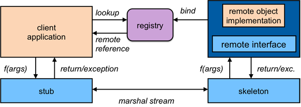

# 常用接口

### 接口和类

所有的远程接口都继承自 `java.rmi.Remote` 接口。例如:

```java
public interface bankaccount extends Remote
{
    public void deposit(float amount)
        throws java.rmi.RemoteException;

    public void withdraw(float amount)
        throws OverdrawnException,
        java.rmi.RemoteException;
}
```

注意,每个方法必须在 throws 里面声明  `java.rmi.RemoteException` 。 只要客户端调用远程方法出现失败，这个异常就会抛出。

### 远程对象类

`Java.rmi.server.RemoteObject` 类提供了远程对象实现的语义包括hashCode、equals　和　toString。 `java.rmi.server.RemoteServer`　及其子类提供让对象实现远程可见。`java.rmi.server.UnicastRemoteObject` 类定义了客户机与服务器对象实例建立一对一的连接.

### 存根

Java RMI 通过创建存根函数来工作。存根由 rmic 编译器生成。自 Java 1.5 以来,Java 支持在运行时动态生成存根类。编译器 rmic 会提供各种编译选项。

### 定位对象

引导名称服务提供了用于存储对远程对象的命名引用。一个远程对象引用可以存储使用类 `java.rmi.Naming` 提供的基于 URL 的方法。例如,

```
BankAccount acct = new BankAcctImpl();
String url = "rmi://java.sun.com/account";
// bind url to remote object
java.rmi.Naming.bind(url, acct);

// look up account
acct = (BankAccount)java.rmi.Naming.lookup(url);
```


