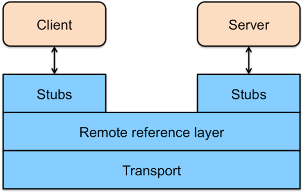

# 架构

### RMI 架构

RMI 是一个三层架构（见图）。最上面是 Stub/Skeleton layer（存根/骨架层）。方法调用从 Stub、Remote Reference Layer (远程引用层)和 Transport Layer（传输层）向下，传递给主机，然后再次经传 Transport Layer 层，向上穿过 Remote Reference Layer 和 Skeleton ，到达服务器对象。 Stub 扮演着远程服务器对象的代理的角色，使该对象可被客户激活。Remote Reference Layer 处理语义、管理单一或多重对象的通信，决定调用是应发往一个服务器还是多个。Transport Layer 管理实际的连接，并且追踪可以接受方法调用的远程对象。服务器端的 Skeleton 完成对服务器对象实际的方法调用，并获取返回值。返回值向下经 Remote Reference Layer 、服务器端的 Transport Layer 传递回客户端，再向上经 Transport Layer 和 Remote Reference Layer 返回。最后，Stub 程序获得返回值。 

要完成以上步骤需要有以下几个步骤： 

* 生成一个远程接口；
* 实现远程对象(服务器端程序)；
* 生成 Stub 和 Skeleton(服务器端程序)；
* 编写服务器程序 ；
* 编写客户程序 ；
* 注册远程对象；
* 启动远程对象 

 
### RMI 分布式垃圾回收

根据 Java 虚拟机的垃圾回收机制原理，在分布式环境下，服务器进程需要知道哪些对象不再由客户端引用，从而可以被删除（垃圾回收）。在 JVM 中，Java 使用引用计数。当引用计数归零时，对象将会垃圾回收。在RMI，Java 支持两种操作 dirty 和 clean。本地 JVM 定期发送一个 dirty 到服务器来说明该对象仍在使用。定期重发 dirty 的周期是由服务器租赁时间来决定的。当客户端没有需要更多的本地引用远程对象时,它发送一个 clean 调用给服务器。不像 DCOM,服务器不需要计算每个客户机使用的对象,只是简单的做下通知。如果它租赁时间到期之前没有接收到任何 dirty 或者 clean 的消息，则可以安排将对象删除。
