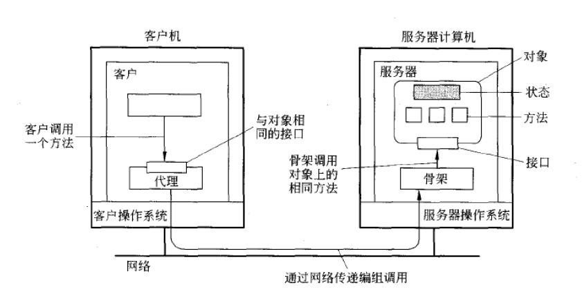

# 概述

在基于对象的分布式系统中，对象的概念在分布式实现中起着极其关键的作用。从原理上来讲，所有的一切都被作为对象抽象出来，而客户端将以调用对象的方式来获得服务和资源。

分布式对象之所以成为重要的范型，是因为它相对比较容易的把分布的特性隐藏在对象接口后面。此外，因为对象实际上可以是任何事务，所以它也是构建系统的强大范型。

面向对象技术于20世纪80年代开始用于开发分布式系统。同样，在达到高度分布式透明性的同时，通过远程服务器宿主独立对象的理念构成了开发新一代分布式系统的稳固的基础。在本节中，我们将看到基于对象的分布式系统的常用体系结构。

## 分布式对象

软件世界中的对象和现实世界中的对象类似，对象存储状态在字段（field）里，而通过方法（methods）暴露其行为。方法对对象的内部状态进行操作，并作为对象与对象之间通信主要机制。隐藏对象内部状态，通过方法进行所有的交互，这个面向对象编程的一个基本原则——数据封装（data encapsulation）。可以通过接口（interface）来使用方法。一个对象可能实现多个接口，而给定的一个接口定义，可能有多个对象为其提供实现。

把接口与实现这些接口的对象进行分隔开，对于分布式系统是至关重要的。严格的隔离允许我们把接口放在一台机器上，而使对象本身驻留在另外一台机器上。这种组织通常称为分布式对象（distributed object）。

（注：该图片引用自《分布式系统原理与范式》一书）

当客户绑定（bind）到一个分布式对象时，就会把这个对象的接口的实现——称为代理（proxy）——加载近客户的地址空间中。代理类似于 RPC 系统中的客户存根（client stub）。它所做的事，是把方法调用编组进消息中，以及对应答消息进行解组，把方法调用的结果返回给客户。实际的对象驻留在服务器计算机上，它在这里提供了与它在客户机上提供的相同的接口。进入的调用请求首先被传递给服务器存根，服务器存根对它们进行解码，在服务器中的对象接口上进行方法的调用。服务器存根还负责对应答进行编码，并把应答消息转发给客户端代理。

服务器端存根通常被称为骨架（skeleton），因为它提供了明确的方式，允许服务器中间件来访问用户定义的对象。实际上，它通常以特定于语言的类的形式包含不完整的代码，需要开发人员来对一步对其进行特殊化处理。

大多数分布式对象的一个特性是它们的状态不是分布式的。状态驻留在单台机器上。在其他机器上，智能地使用被对象实现的接口。这样的对象也被称为远程对象（remote object）。分布式对象的状态本身可能物理地分布在多台机器上，但是这种分布对于对象接口背后的客户来说是透明的。

## Java RMI

目前，常用的分布式对象常用技术有微软 DCOM（COM+）、CORBA 以及 Java RMI 等。

CORBA 旨在提供一组全面的服务来管理在异构环境中（不同语言、操作系统、网络）的对象。Java 在其最初只支持通过 socket 来实现分布式通信。1995年，作为 Java 的缔造者，Sun 公司开始创建一个 Java 的扩展，称为 Java RMI（Remote Method Invocation，远程方法调用）。Java RMI 允许程序员创建分布式应用程序时，可以从其他 Java 虚拟机（JVM）调用远程对象的方法。

一旦应用程序（客户端）引用了远程对象，就可以进行远程调用了。这是通过 RMI 提供的命名服务（RMI 注册中心）来查找远程对象，来接收作为返回值的引用。Java RMI 在概念上类似于 RPC，但能在不同地址空间支持对象调用的语义。

与大多数其他诸如 CORBA 的 RPC 系统不同，RMI 只支持基于 Java 来构建，但也正是这个原因， RMI 对于语言来说更加整洁，无需做额外的数据序列化工作。Java RMI 的设计目标应该是:

* 能够适应语言、集成到语言、易于使用；
* 支持无缝的远程调用对象；
* 支持服务器到 applet 的回调；
* 保障 Java 对象的安全环境；
* 支持分布式垃圾回收；
* 支持多种传输。

分布式对象模型与本地 Java 对象模型相似点在于:

* 引用一个对象可以作为参数传递或作为返回的结果；
* 远程对象可以投到任何使用 Java 语法实现的远程接口的集合上；
* 内置 Java instanceof 操作符可以用来测试远程对象是否支持远程接口。

不同点在于:

* 远程对象的类是与远程接口进行交互，而不是与这些接口的实现类交互；
* Non-remote 参数对于远程方法调用来说是通过复制，而不是通过引用；
* 远程对象是通过引用来传递，而不是复制实际的远程实现；
* 客户端必须处理额外的异常。